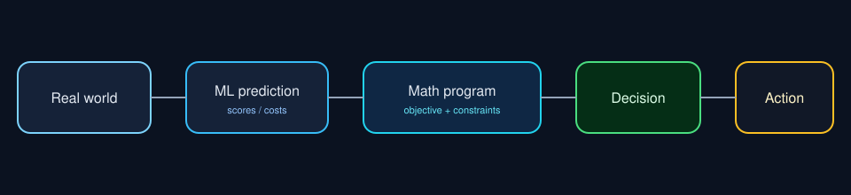
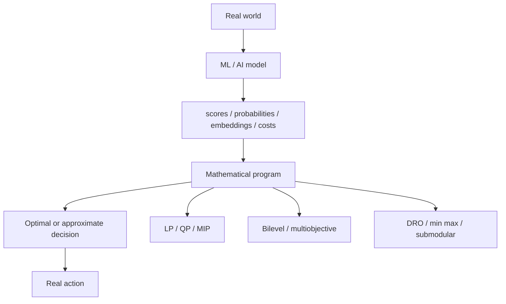

# MathProg AI Atlas

[](LICENSE)
[](docs/thesis.md)
[](catalog/repositories.md)

**Machine learning predicts. Mathematical programming decides.**

This repository is a living atlas of that interface. It turns a taxonomy of mathematical programs into a documentation standard you can clone, annotate, and grow.

<p align="center">
  
</p>

Modern models emit scores, probabilities, embeddings, costs, and utilities. Those outputs still have to become actions that survive budgets, capacities, integrality, safety limits, competing objectives, and uncertainty. The atlas names the program that performs that last step.

## Why this exists

AI systems are often studied in isolation, method by method. The same decision structure keeps returning.

| You think you are building | You are often solving |
| --- | --- |
| RAG context packing | multidimensional knapsack |
| Mixture of Experts routing | capacity constrained assignment |
| Test time compute allocation | multiple choice knapsack |
| KV cache eviction | monotone submodular selection |
| Robust preference alignment | distributionally robust optimization |
| Neural architecture search | bilevel program |
| GAN training | min max game |

Once the structure is named, you can choose a solver, a relaxation, a certificate, or an honest heuristic. You can also refuse a claim that does not match the algorithm you shipped.

Full argument: [docs/thesis.md](docs/thesis.md)

## The pipeline



Three rules travel with every diagram.

1. A perfect optimizer cannot repair a missing candidate.
2. A greedy policy does not inherit a MIP certificate.
3. Live execution is a fourth error source, not a deployment afterthought.

Error budget: [docs/error-budget.md](docs/error-budget.md)

## Thirteen paradigms

The map follows the application driven taxonomy in
*Mathematical Programming in Machine Learning and Artificial Intelligence: A Unified Taxonomy of Models and Applications* (Chaosheng Dong, 2026) and the companion infographic *From Mathematical Programming to AI Applications*.

Notes for every box: [docs/paradigms/overview.md](docs/paradigms/overview.md)

| # | Paradigm | What is decided | AI examples |
| ---: | --- | --- | --- |
| 1 | [Linear programming](docs/paradigms/overview.md#1-linear-programming) | Continuous allocation on a polyhedron | compressed sensing, multi object tracking |
| 2 | [Quadratic programming](docs/paradigms/overview.md#2-quadratic-programming) | Continuous choices with pairwise cost | LLE weights, SVM duals, MPC |
| 3 | [Binary integer programming](docs/paradigms/overview.md#3-binary-integer-programming) | Include or exclude | RAG selection, MoE routing, tool use |
| 4 | [Mixed integer programming](docs/paradigms/overview.md#4-mixed-integer-programming) | Discrete plus continuous | constrained retrieval, mixed precision, clustering |
| 5 | [Binary quadratic programming](docs/paradigms/overview.md#5-binary-quadratic-programming) | Binary choices that interact | diversity aware recommendation |
| 6 | [Conic optimization](docs/paradigms/overview.md#6-conic-optimization) | Cone constraints such as SOCP | Group Lasso, robust norms |
| 7 | [Semidefinite programming](docs/paradigms/overview.md#7-semidefinite-programming) | PSD matrices | sparse PCA relaxations |
| 8 | [Bilevel optimization](docs/paradigms/overview.md#8-bilevel-optimization) | Parameters that change an inner solve | HPO, NAS, coresets |
| 9 | [Multiobjective optimization](docs/paradigms/overview.md#9-multiobjective-optimization) | Pareto tradeoffs | multi task learning |
| 10 | [Inverse optimization](docs/paradigms/overview.md#10-inverse-optimization) | Recover the objective from behavior | inverse RL |
| 11 | [Distributionally robust optimization](docs/paradigms/overview.md#11-distributionally-robust-optimization) | Worst plausible distribution | robust contrastive learning, robust alignment |
| 12 | [Submodular optimization](docs/paradigms/overview.md#12-submodular-optimization) | Sets with diminishing returns | data selection, summarization, KV eviction |
| 13 | [Min max optimization](docs/paradigms/overview.md#13-min-max-optimization) | Two players | GANs, adversarial training |

### Canonical forms

```text
LP        min c^T x                 s.t. A x <= b
QP        min 1/2 x^T Q x + c^T x   s.t. A x <= b
BIP       max c^T x                 s.t. A x <= b, x in {0,1}^n
MIP       min f(x)                  s.t. A x <= b, some x integer
BQP       max x^T Q x + c^T x       s.t. x in {0,1}^n
SOCP      min ||A x - b||_2         s.t. ||x_g||_2 <= t_g
SDP       min <C, X>                s.t. A(X) = b, X succeq 0
Bilevel   min F(x*(lambda), lambda) s.t. x*(lambda) in argmin f(x, lambda)
MOO       min (L1(theta), ..., LT(theta))
Inverse   recover theta             s.t. y ~ argmin c(theta)^T x
DRO       min_theta max_{Q in U(P)} E_Q[loss(theta; xi)]
Submod    max f(S)                  s.t. |S| <= k
Min-max   min_G max_D V(D, G)
```

## Three worked mappings

### RAG as a knapsack

```text
retrieve 1000 passages
        |
        v
relevance scores from a model
        |
        v
select 10 passages
        | token budget
        | redundancy
        | evidence value
        v
LLM context
```

The exact form is a multiple choice multidimensional knapsack. The deployed form is usually greedy or learned reranking with the same constraints written in prose. Keep those two sentences apart.

Runnable toy: [`examples/rag_knapsack.py`](examples/rag_knapsack.py)

### Mixture of Experts as assignment

```text
tokens --> gate scores --> assignment
                             | token needs an expert
                             | expert has capacity
                             v
                         expert compute
```

Routing is not just a softmax once capacity exists. It is an assignment program. Softmax is a differentiable heuristic for that program.

### Test time compute as a budget

```text
queries --> expected utility --> allocate compute
                                   | easy query: small budget
                                   | hard query: large budget
                                   | total FLOPs fixed
```

Same knapsack family. The coefficient is now expected gain per unit compute, not passage relevance.

## Bilevel, robust, and adversarial structure

These three paradigms are how modern training actually looks when you stop flattening it into one loss.

```mermaid
flowchart LR
    subgraph bilevel
      L[outer: choose lambda] --> I[inner: train theta*(lambda)]
      I --> V[outer: validation loss]
    end
    subgraph dro
      P[empirical P] --> U[nearby Q]
      U --> W[worst expected loss]
    end
    subgraph game
      G[generator] --> D[discriminator]
      D --> G
    end
```

Bilevel is nested learning. DRO is uncertainty about the data law. Min max is a second player. An LLM that proposes an experiment and a simulator that fits parameters can look bilevel without being a smooth bilevel program. Write the structure you actually have.

## Cross paradigm stack

Real systems do not stay in one box.

```text
data
  -> learned coefficients   (sometimes bilevel, DRO, multiobjective)
  -> decision program       (LP, QP, MIP, conic)
  -> action                 (route, select, allocate)
```

A robust trainer can produce the costs. A MIP can consume them. An SDP can bound a relaxation. Duality can decompose an assignment. The atlas is a map of those joints.

## Repository catalog

Ten repositories for each of the thirteen paradigms live in [catalog/repositories.md](catalog/repositories.md).

Start with this shared layer.

| Layer | Repository | Use it for |
| --- | --- | --- |
| Modeling | [cvxpy/cvxpy](https://github.com/cvxpy/cvxpy) | Convex programs written as math |
| Discrete | [google/or-tools](https://github.com/google/or-tools) | Assignment, routing, knapsacks |
| Algebraic | [Pyomo/pyomo](https://github.com/Pyomo/pyomo) | Structured models larger than a notebook |
| Research modeling | [jump-dev/JuMP.jl](https://github.com/jump-dev/JuMP.jl) | Fast formulation work |
| Open LP/MIP | [ERGO-Code/HiGHS](https://github.com/ERGO-Code/HiGHS) | Simplex, interior point, MIP |
| Convex QP | [osqp/osqp](https://github.com/osqp/osqp) | Control and learning QPs |
| Differentiable opt | [cvxpy/cvxpylayers](https://github.com/cvxpy/cvxpylayers) | Optimization as a layer |
| Multiobjective | [anyoptimization/pymoo](https://github.com/anyoptimization/pymoo) | Pareto fronts |
| Submodular sets | [jmschrei/apricot](https://github.com/jmschrei/apricot) | Data subset selection |
| DRO | [namkoong-lab/dro](https://github.com/namkoong-lab/dro) | Robust expected loss |
| IRL | [HumanCompatibleAI/imitation](https://github.com/HumanCompatibleAI/imitation) | Inverse objectives from behavior |
| Min max | [eriklindernoren/PyTorch-GAN](https://github.com/eriklindernoren/PyTorch-GAN) | Generative adversarial recipes |

## How to read a claim

Use this checklist when a paper or a teammate says we optimized it.

1. What is the decision variable?
2. What is continuous, binary, nested, robust, or adversarial?
3. Who produced the coefficients?
4. Did candidate generation already drop the optimum?
5. Is the deployed algorithm exact, a relaxation, or a heuristic?
6. What is the solver gap on the instances you ship?
7. What changes between the model and the live system?

If those answers are missing, the formulation is a mood, not a method.

## Repository layout

```text
mathprog-ai-atlas
├── README.md                 teaching surface
├── docs/
│   ├── thesis.md             one page argument
│   ├── error-budget.md       four loss sources
│   ├── roadmap.md            how the atlas should grow
│   └── paradigms/overview.md thirteen notes
├── catalog/repositories.md   ten repos per paradigm
├── examples/rag_knapsack.py  exact toy for RAG selection
└── assets/diagrams/          SVG figures
```

This layout is the documentation template. New technical repos can copy the same bones: one thesis page, one error budget, one catalog, one runnable example, diagrams that name a decision.

## Run the toy

```bash
pip install pulp
python examples/rag_knapsack.py
```

You should see a binary selection that respects a token budget, a cardinality cap, and a redundancy cut. That is the whole thesis in one script: scores arrive from outside, the program decides.

## Documentation standard

Copy this voice later.

- Name the decision before the architecture.
- Write the program in mathematics, then name the solver.
- Separate prediction, candidates, optimization, and execution.
- Do not advertise a certificate the code does not compute.
- Prefer one worked example over a gallery of badges.

Contribution rules: [CONTRIBUTING.md](CONTRIBUTING.md)

## Source

The taxonomy and application map are synthesized from:

- Chaosheng Dong, *Mathematical Programming in Machine Learning and Artificial Intelligence: A Unified Taxonomy of Models and Applications*, 2026
- Companion infographic: *From Mathematical Programming to AI Applications*

This repository is an educational atlas and catalog. It is not the paper and it is not affiliated with the author.

## License

MIT. See [LICENSE](LICENSE).
